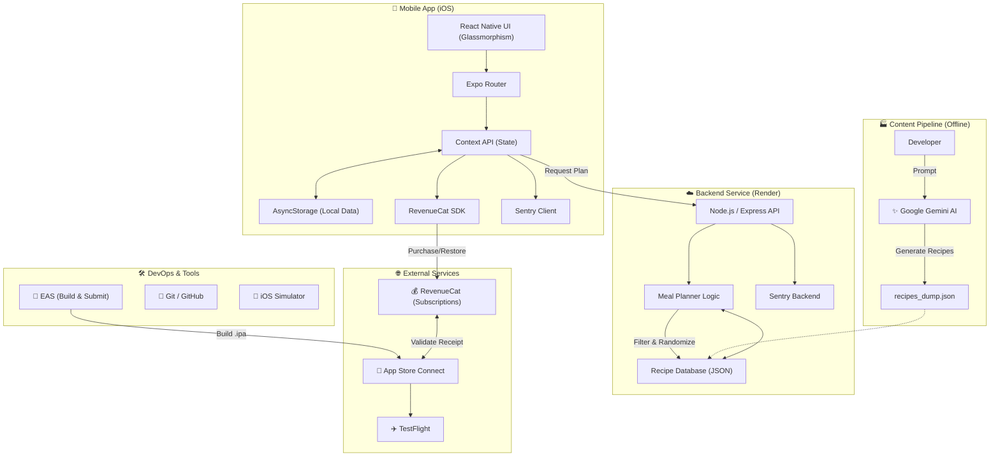

# 🏗️ Architecture & Tech Stack: Quick Meal Planner

This document outlines the high-level architecture, technology decisions, and toolchain used to build and deploy the Quick Meal Planner (v1.0).

## 🧩 System Overview Diagram (Mermaid)

---

## 🛠️ Technology Stack

### 1. Frontend (Mobile App)
*   **Framework**: **React Native** (managed via **Expo**).
*   **Language**: JavaScript (ES6+).
*   **Navigation**: **Expo Router** (File-based routing).
*   **State Management**: **React Context API** (`PlanContext`).
*   **Persistence**: **AsyncStorage** (Local-first data storage for plans/shopping lists).
*   **Styling**: Custom **Glassmorphism** Design System (Vanilla `StyleSheet` with transparency constants).
*   **Icons**: `Ionicons` (@expo/vector-icons).

### 2. Backend (API)
*   **Runtime**: **Node.js**.
*   **Framework**: **Express.js**.
*   **Hosting**: **Render** (Web Service).
*   **Data Source**: **JSON Flat File** (`recipes_dump.json`).
    *   *Mechanism*: In-memory loading and filtering of pre-generated recipe data.
    *   *Performance*: Zero-latency, zero-cost per request.
*   **Security**: Rate Limiting (`express-rate-limit`), HELMET, CORS.

### 3. Content Generation (AI)
*   **Engine**: **Google Gemini 1.5 Flash**.
*   **Usage**: Used **Offline** by developers to bulk-generate high-quality recipes, ingredients, and instructions. These are compiled into `recipes_dump.json` which is shipped with the backend.

### 4. Monetization & Analytics
*   **In-App Purchases (IAP)**: **RevenueCat**.
    *   *Role*: Handles validation, entitlement logic ("Pro" vs "Free"), and paywall restoration.
    *   *Products*: "Pro Monthly" ($4.99), "Pro Yearly" ($29.99).
*   **App Store**: **App Store Connect**.
    *   *Role*: Hosting the binary, managing descriptions, compliance, and distribution.

### 4. DevOps & Tooling
*   **Build System**: **EAS (Expo Application Services)**.
    *   *Commands*: `eas build`, `eas submit`.
*   **Error Tracking**: **Sentry**.
    *   *Role*: Captures crashes and runtime errors in both Frontend and Backend.
*   **Code Quality**: **Jest** (Unit/Integration Tests).
*   **Version Control**: **Git**.

---

## 🔄 Key Data Flows

### A. Meal Plan Generation
1.  **User** selects preferences (Diet: Keto, Days: 7) in App.
2.  **App** sends POST request to Backend `/api/generate-plan`.
3.  **Backend** constructs a highly tuned prompt for **Gemini**.
4.  **Gemini** returns a JSON structure containing recipes and ingredients.
5.  **Backend** sanitizes response and returns it to App.
6.  **App** saves data to `PlanContext` and `AsyncStorage` (Offline access).

### B. Subscription Flow
1.  **User** hits limits (e.g. trying to plan 7 days while on Free tier).
2.  **App** shows `PaywallModal`.
3.  **User** taps "Yearly Subscription".
4.  **RevenueCat SDK** initiates Apple Paysheet.
5.  **Apple** processes payment.
6.  **RevenueCat** validates receipt and returns "Active Entitlement".
7.  **App** unlocks features (persisted locally).

---

## 📂 Project Structure Guide

*   `frontend/` - The React Native App.
    *   `app/` - Screens and Routing.
    *   `components/` - Reusable UI (Paywall, InputForm, Cards).
    *   `context/` - Global State Logic.
    *   `assets/` - Images/Icons.
*   `backend/` - The Node.js API.
    *   `routes/` - API Endpoints.
    *   `services/` - Gemini Logic (`planner.js`).
*   `.agent/` - Agent Workflow and Memory.
