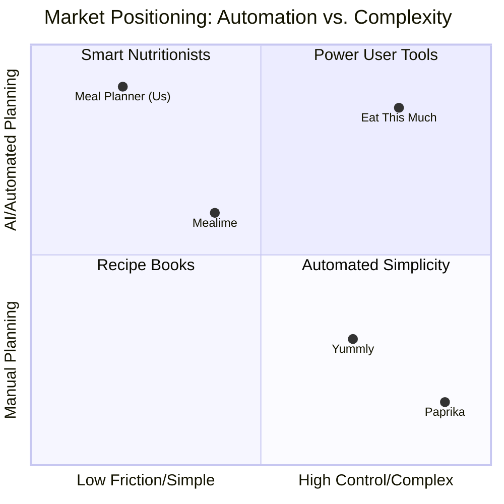

# 📊 Market Analysis & Strategy (2025/2026)

**Last Updated:** 2026-01-10
**Version:** 1.0

## 1. Competitive Landscape

The meal planning market splits into three distinct categories. Our app creates a niche by combining **High Automation** with **High UX/Simplicity**, avoiding the "spreadsheet feel" of power-user tools.

### The Competitors

| App Name | Category | Primary Value Prop | Weakness |
| :--- | :--- | :--- | :--- |
| **Mealime** | The "Quick & Easy" | Simple, 30-min recipes, waste reduction. | Limited customization in free tier. |
| **Eat This Much** | The "Auto-Nutritionist" | Database-driven, hits exact macro targets. | UX feels like a calculator; sterile. |
| **Paprika 3** | The "Power Tool" | User imports own recipes. Ultimate organization. | No decision help; high friction to start. |
| **Ollie / Meal Flow** | The "New Wave AI" | "Cook from fridge", family logistics. | Feature bloat; complex onboarding. |

### Visual Positioning Graph

Recent analysis places us in the **"Automated Simplicity"** quadrant—a highly desirable spot for casual users who find tracking macros too tedious but manual planning too time-consuming.

*(Note: In our case, being "Low Friction" (Left) and "High Automation" (Top) is the sweet spot for mass-market appeal.)*

---

## 2. Feature Capability Gap Analysis

| Feature | Market Standard | Meal Planner (v1.0.3) | Status | Action Plan |
| :--- | :--- | :--- | :--- | :--- |
| **Plan Generation** | 7-Day, Diet Filters | 7-Day, Diet Preferences | ✅ Parity | Maintain. |
| **Content Volume** | 1,000+ Recipes | ~90 Recipes | ⚠️ **Critical Gap** | **Priority:** Accelerate AI content pipeline. |
| **Platform** | Web + Mobile | iOS Mobile Only | ⚠️ Gap | Pitch as "Native Focus" for now. |
| **Offline Mode** | Spotty / Pro Only | **Local-First / Robust** | 🏆 **Advantage** | **Marketing Angle:** "Works in the grocery store basement." |
| **Aesthetics** | Generic / Utilitarian | **Glassmorphism / haptics** | 🏆 **Advantage** | **Marketing Angle:** "Meal planning that feels good." |
| **Recipe Layout** | Text Blocks | Step-by-Step Mode | ✅ Parity | Explore "Cooking Mode" (Keep screen on). |

---

## 3. The "Trust Gap" & Marketing Ethics

**Challenge:** We use AI to generate recipes. We cannot honestly claim "Chef-Tested" without actual culinary review. Doing so risks user trust if a recipe fails.

### Revised Positioning Prompts
Instead of "Chef-Tested," we will use claims that highlight the *curation* and *source quality* while being transparent about the tech.

| ❌ Don't Say | ✅ Do Say | Why? |
| :--- | :--- | :--- |
| "Chef-Tested Recipes" | "Culinary AI Models" | Accurate. Implies intelligence without lying about a human chef. |
| "Guaranteed Delicious" | "High-Rated Classics" | Focus on the *type* of dishes (proven concepts) rather than the specific AI instance. |
| "Perfectly Balanced" | "Nutritionally Guided" | Softens the claim while highlighting the health focus. |

### Future Mitigation: The "Verified" Badge
To bridge this gap in v1.1 or v1.2:
1.  **Community Voting:** Allow users to "Upvote" or "Verify" a recipe works.
2.  **The "Golden 100":** Manually test (or hire a freelancer to test) the top 100 most popular recipes and mark them as "Verified Delicious."

---

## 4. Strategic Recommendations

### Immediate (v1.1)
1.  **Solve the Content Drought:** Content is the biggest churn risk. If a user sees the same meal twice in a week, they cancel.
    *   *Goal:* 500+ Recipes.
    *   *Method:* Bulk-generate using higher-temp AI for variety, then filter for hallucinations.
2.  **Lean into Privacy:** Position "Local-First" not just as a tech feature, but a privacy feature. "Your diet is your business."

### Marketing Channels
1.  **Visual Socials (TikTok/Pinterest):** Our glassmorphic UI is our best asset. Static screenshots on the App Store are good, but video showing the *interactions* (swiping, checking off items) works better.
2.  **Search Ads:** Target "Offline Meal Planner" and "Simple Meal Plan."

---

## 5. The User Perspective (Persona)
**Why they buy:** "I don't simply want a list of food. I want decision relief. This app looks better than the ugly ones, and it works when I have no signal at Whole Foods."
**Why they churn:** "I got bored of the recipes." OR "I couldn't add that one recipe I found on Instagram."
